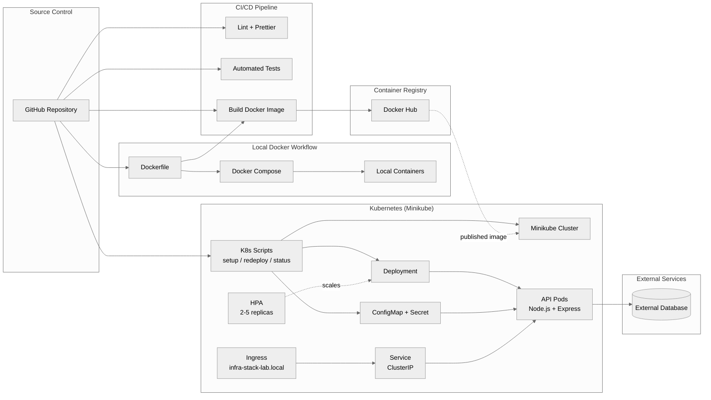

# 🚀 Infra Stack Lab

A hands-on project focused on practicing **DevOps fundamentals**, **containerization**, and **Kubernetes-based orchestration**.

This repository demonstrates how to build, run, and manage services using both **Docker Compose** and **Kubernetes (Minikube)** in a clean, reproducible, and production-inspired workflow.

---

## 🧠 Purpose

This project was created to:

- Practice working with **Docker & containerized services**
- Simulate a **multi-service environment**
- Learn **Kubernetes fundamentals (Deployment, Service, Ingress, HPA)**
- Build real-world **DevOps habits and workflows**

---

## 🛠️ Tech Stack

- Docker
- Docker Compose
- Kubernetes (Minikube)
- Node.js (Express API)
- PostgreSQL

---

## 📦 Project Structure

```
infra-stack-lab
├── drizzle/          # Database migrations & metadata (Drizzle ORM)
├── logs/             # Application logs (combined, error)
├── scripts/          # Dev & production helper scripts
├── src/              # Main application source code
│   ├── config/       # App configuration (DB, logger, Arcjet)
│   ├── controllers/  # Request handlers (auth, users)
│   ├── middleware/   # Express middlewares (auth, security)
│   ├── models/       # Data models
│   ├── routes/       # API route definitions
│   ├── services/     # Business logic layer
│   ├── utils/        # Helper utilities
│   └── validations/  # Request validation schemas
├── tests/            # Integration & unit tests
└── k8s/              # Kubernetes manifests & documentation
```

---

## 🏗️ Architecture Overview



---

## ⚙️ Getting Started

### Clone the repo

```bash
git clone https://github.com/Eladgel1/infra-stack-lab.git
cd infra-stack-lab
```

## 🐳 Running with Docker Compose

### Run the stack

```bash
docker compose up --build
```

### Stop the stack

```bash
docker compose down
```

---

## ☸️ Running with Kubernetes (Minikube)

### Prerequisites

- Docker Desktop
- Minikube
- kubectl

### 1. Start Minikube

```bash
minikube start
```

### 2. Enable required addons

```bash
minikube addons enable ingress
minikube addons enable metrics-server
```

### 3. Deploy the application

```bash
npm run k8s:up
```

### 4. ⚠️ Important (Windows + Docker driver)

If you are using **Windows with Docker Desktop**, you must run:

```bash
minikube tunnel
```

in a separate terminal.

Also ensure your `hosts` file includes:

```
127.0.0.1 infra-stack-lab.local
```

### 5. Access the application

```
http://infra-stack-lab.local
```

---

## 📄 Kubernetes Resources

- Deployment (application pods)
- Service (ClusterIP)
- Ingress (domain routing)
- HPA (Horizontal Pod Autoscaler)
- ConfigMap & Secret

See full documentation in:

```
k8s/README.md
```

---

## 🎯 Key Concepts Practiced

- Containerization
- Kubernetes orchestration
- Ingress routing
- Autoscaling (HPA)
- Local infrastructure simulation
- DevOps workflows & automation

---

## 📬 Contact

If you're interested in collaborating or sharing ideas, feel free to reach out 🚀
