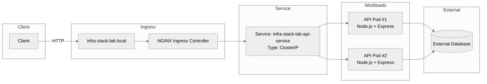

# ☸️ Kubernetes Documentation

This document describes Kubernetes setup, architecture, and operational workflows in this project.

---

## 🧠 Overview

This project uses **Minikube** to simulate a production-like Kubernetes environment locally.

It includes:

- Deployment (API pods)
- Service (internal communication)
- Ingress (external access via domain)
- HPA (autoscaling)
- ConfigMap & Secret

---

## 🏗️ Kubernetes Runtime Architecture



---

## 📦 Manifests

Located in:

```
k8s/
```

### Files:

- `namespace.yaml`
- `configmap.yaml`
- `secret.yaml`
- `deployment.yaml`
- `service.yaml`
- `ingress.yaml`
- `hpa.yaml`
- `kustomization.yaml`

---

## 🚀 Setup Flow

### 1. Start Minikube

```bash
minikube start
```

### 2. Enable addons

```bash
minikube addons enable ingress
minikube addons enable metrics-server
```

### 3. Deploy everything

```bash
npm run k8s:up
```

---

## ⚠️ Important (Windows + Docker Desktop)

When using Minikube with Docker driver on Windows:

### You MUST run:

```bash
minikube tunnel
```

in a separate terminal.

### And configure hosts file:

```
127.0.0.1 infra-stack-lab.local
```

### Why?

- Docker driver isolates networking
- Ingress is not directly reachable
- Tunnel creates a bridge to localhost

---

## 🧩 Using Kustomize (Optional)

Alternatively, you can deploy everything using Kustomize:

```bash
kubectl apply -k k8s/
```

This will apply all resources defined in `k8s/kustomization.yaml`

---

## 🌐 Accessing the App

```
http://infra-stack-lab.local
```

Health endpoint:

```bash
curl http://infra-stack-lab.local/health
```

---

## 📊 Autoscaling (HPA)

Configuration:

- Min replicas: 2
- Max replicas: 5
- Target CPU: 70%

Check status:

```bash
kubectl get hpa -n infra-stack-lab
```

---

## 🔍 Debugging

### Pods

```bash
kubectl get pods -n infra-stack-lab
```

### Logs

```bash
kubectl logs <pod-name> -n infra-stack-lab
```

### Ingress

```bash
kubectl describe ingress -n infra-stack-lab
```

---

## 🔁 Redeploy

```bash
npm run k8s:redeploy
```

---

## 🧹 Cleanup

```bash
minikube stop
```

or

```bash
minikube delete
```

---

## 🎯 What This Demonstrates

- Kubernetes fundamentals
- Local cluster orchestration
- Ingress routing with custom domain
- Autoscaling with HPA
- DevOps workflow automation

---
